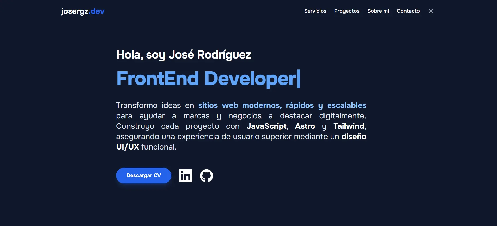

# 🌐 Frontend Developer Portfolio

This repository contains my personal portfolio, where I showcase my work as a **Frontend Developer** focused on building clean, responsive, and user-centered web interfaces.

The portfolio is built with **Astro** and **Tailwind CSS**, prioritizing performance, accessibility, and modern UI practices.

---

## 📸 Preview

---

## 🚀 Tech Stack

- **Astro** – Static-first framework for fast and optimized websites.
- **Tailwind CSS** – Utility-first CSS for scalable and maintainable UI.
- **JavaScript (ES6+)** – Interactive and dynamic web behavior.
- **Vercel** – Deployment and hosting.

---

## ✨ Key Features

- **Performance Focused:** Optimized images and minimal JS for lightning-fast loading.
- **Fully Responsive:** Seamless experience across mobile, tablet, and desktop.
- **SEO & Accessibility:** Proper semantic HTML and meta-tags.

---

## 🛠️ Getting Started

If you want to run this project locally:

1. **Clone the repository:**
   `git clone https://github.com/josergz/portfolio.git`

2. **Install dependencies:**
   `npm install`

3. **Start the development server:**
   `npm run dev`

---

## 💬 Contact

I’m always open to new opportunities and collaborations! 🙌

- 📧 **Email:** [contacto@josergz.dev](mailto:contacto@josergz.dev)
- 💼 **LinkedIn:** [linkedin.com/in/josergz/](https://www.linkedin.com/in/josergz/)
- 🌐 **Live Demo:** [josergz.dev](https://josergz.dev)

---

Thank you for visiting my portfolio! 🚀
